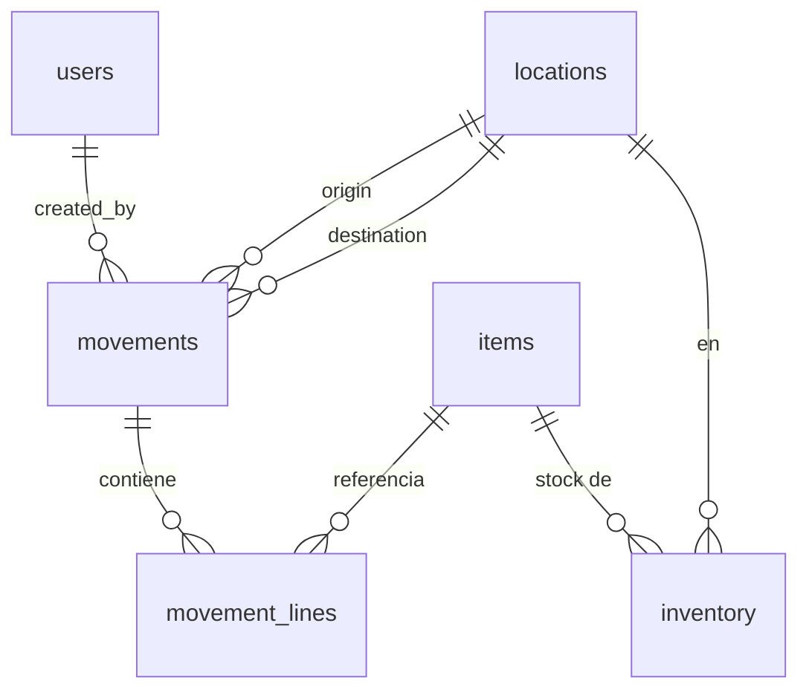
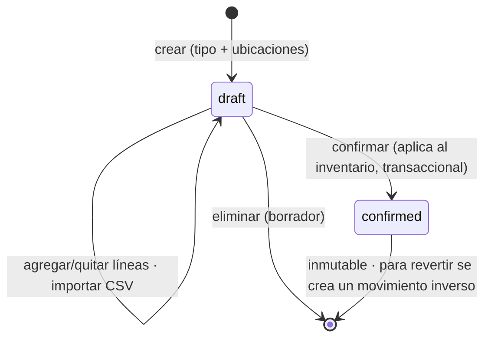

# Plan: Registro de inventarios y movimientos entre ubicaciones

> Documento de diseño. **No se implementa nada todavía.** El objetivo es acordar
> las tablas, los módulos y las reglas antes de escribir código.

## 1. Objetivo

Permitir llevar el **registro de inventario** (stock por ubicación) y que un
usuario con rol `logistic` pueda **crear movimientos** de una ubicación de
origen a una de destino, con un listado de items. Se debe poder **importar y
exportar CSV**, y respetar el flag **`unique`** de los items (solo 1 unidad).

## 2. Módulos nuevos (y cambios a `items`)

Siguiendo la convención "un módulo por carpeta" (ver `AGENTS.md`), se proponen
**3 módulos nuevos** + una modificación pequeña al módulo `items` existente.

| Módulo        | Tabla(s) que posee            | Rol principal        | Qué hace |
| ------------- | ----------------------------- | -------------------- | -------- |
| `locations`   | `locations`                   | `logistic` / `admin` | CRUD de ubicaciones (bodegas, tiendas, tránsito). |
| `inventory`   | `inventory`                   | lectura para todos   | Muestra el stock actual por ubicación/item. Export CSV. Lo **mantiene** el módulo de movimientos. |
| `movements`   | `movements`, `movement_lines` | `logistic` / `admin` | Crear/listar/confirmar movimientos de stock (entrada/transferencia/salida). Import/Export CSV de líneas. |
| `items` (mod) | `items` (refactor)            | `logistic` / `admin` | **Catálogo compartido**: se quita el scoping por usuario (todos ven todo) y se agregan `is_unique`, `sku` y `created_by`. |

> **Decisiones tomadas** (antes marcadas "por definir"; ver §12):
>
> - **`items` es catálogo compartido (org-wide).** Cuando un logístico crea un
>   item, queda visible para todos. Se guarda `created_by` solo para auditoría.
>   Requiere refactor del módulo `items` (ver §3.1). Es una divergencia
>   deliberada de la regla "Scope per-user data by `user.id`" de `AGENTS.md`.
> - **Nombre del módulo:** `movements` (movimientos).
> - **`inventory` separado de `movements`:** el inventario es el "saldo actual"
>   de solo lectura; los movimientos son el "libro" que lo modifica.
> - **Tipos de movimiento (`kind`):** `intake` (entrada, solo destino),
>   `transfer` (origen→destino) y `dispatch` (salida, solo origen). Así el stock
>   puede **entrar** al sistema (si no, todo quedaría en 0 para siempre) y todo
>   queda en un solo libro. **A confirmar** (§12 Q1).

### Dependencias entre módulos

`movements` **lee y escribe** el stock a través del `InventoryRepository` del
módulo `inventory` (mismo patrón que hoy usa `users` reutilizando el
`UserRepository` de `auth`). Ambos referencian `items` y `locations`.



## 3. Tablas a crear (esquema propuesto)

Estilo alineado al proyecto: `INTEGER PRIMARY KEY AUTOINCREMENT`, timestamps con
`datetime('now')`, FKs con `REFERENCES`, booleanos como `INTEGER 0/1`. Sin
migraciones (ver §9).

### 3.1 `items` — modificación

Se agrega el flag de unicidad. `unique` es palabra reservada en SQL, por eso la
columna se llama **`is_unique`**. No hay `ALTER TABLE`: simplemente se **edita el
`CREATE TABLE` existente** (agregando la columna) y se recrea la base con
`bun resetdb` (ver §9).

`CREATE TABLE items` resultante (editar el existente, no crear otro):

```sql
CREATE TABLE IF NOT EXISTS items (
  id         INTEGER PRIMARY KEY AUTOINCREMENT,
  sku        TEXT    NOT NULL UNIQUE,           -- clave legible/estable para CSV, ej. "SKU-0001"
  name       TEXT    NOT NULL,
  tags       TEXT    NOT NULL DEFAULT '',
  status     TEXT    NOT NULL DEFAULT 'draft',  -- draft | active | archived (archived = borrado suave)
  is_unique  INTEGER NOT NULL DEFAULT 0,        -- 0 = normal, 1 = único (máx. 1 unidad en todo el sistema)
  created_by INTEGER NOT NULL REFERENCES users(id),  -- auditoría: quién lo creó (reemplaza a user_id)
  created_at TEXT    NOT NULL DEFAULT (datetime('now')),
  updated_at TEXT    NOT NULL DEFAULT (datetime('now'))
);
```

**Refactor de `items` a catálogo compartido** (todos ven todos los items):

- Renombrar `user_id` → `created_by` (sigue siendo FK a `users`, pero es solo
  auditoría, no filtro).
- Quitar el scoping por usuario en `ItemRepository`: `list(params)`, `get(id)`,
  `update(id, input)`, `delete(id)` y `distinctTags()` **ya no** reciben ni
  filtran por `userId`. `create(input, createdBy)` guarda quién creó.
- `is_unique`: nuevo flag (ver §6). `sku`: requerido y único (clave del CSV,
  §7); el form lo pide y el seed lo genera (`SKU-0001`, …).
- Permisos sin cambios (logistic/admin escriben, el resto lee), pero ahora
  aplican a **todo** el catálogo.
- Reemplazar el **borrado duro** por archivar (`status = 'archived'`) cuando el
  item ya tiene inventario/movimientos (ver §8/§14).

> Nota: al implementar, `AGENTS.md` necesitará una excepción a "Scope per-user
> data by `user.id`" para estos módulos de catálogo/inventario compartido.

### 3.2 `locations` (módulo `locations`)

```sql
CREATE TABLE IF NOT EXISTS locations (
  id         INTEGER PRIMARY KEY AUTOINCREMENT,
  code       TEXT    NOT NULL UNIQUE,           -- código corto legible, ej. "BOD-01"
  name       TEXT    NOT NULL,
  kind       TEXT    NOT NULL DEFAULT 'warehouse', -- warehouse | store | transit | ...
  is_active  INTEGER NOT NULL DEFAULT 1,
  created_at TEXT    NOT NULL DEFAULT (datetime('now')),
  updated_at TEXT    NOT NULL DEFAULT (datetime('now'))
);
```

### 3.3 `movements` (módulo `movements`)

Cabecera del movimiento: **tipo** (`kind`), origen/destino (según el tipo),
estado y auditoría. La referencia legible (`MOV-000123`) se **deriva del `id`**
en la vista; no se guarda una columna `code` (evita generar/coordinar números).

```sql
CREATE TABLE IF NOT EXISTS movements (
  id             INTEGER PRIMARY KEY AUTOINCREMENT,
  kind           TEXT    NOT NULL DEFAULT 'transfer', -- intake | transfer | dispatch
  origin_id      INTEGER REFERENCES locations(id),    -- requerido en transfer/dispatch; NULL en intake
  destination_id INTEGER REFERENCES locations(id),    -- requerido en transfer/intake; NULL en dispatch
  status         TEXT    NOT NULL DEFAULT 'draft',     -- draft | confirmed | cancelled
  notes          TEXT    NOT NULL DEFAULT '',
  created_by     INTEGER NOT NULL REFERENCES users(id),
  created_at     TEXT    NOT NULL DEFAULT (datetime('now')),
  updated_at     TEXT    NOT NULL DEFAULT (datetime('now')),
  confirmed_at   TEXT,
  -- Direcciones válidas y nulabilidad según el tipo:
  CHECK (
    (kind = 'transfer' AND origin_id IS NOT NULL AND destination_id IS NOT NULL AND origin_id <> destination_id) OR
    (kind = 'intake'   AND origin_id IS NULL     AND destination_id IS NOT NULL) OR
    (kind = 'dispatch' AND origin_id IS NOT NULL AND destination_id IS NULL)
  )
);
```

> Si prefieres **solo transferencias** (origen→destino siempre), se elimina
> `kind`, `origin_id`/`destination_id` vuelven a `NOT NULL`, y el stock inicial
> entra por un **import CSV de saldos** al inventario (§7.2). Ver §12 Q1.

### 3.4 `movement_lines` (módulo `movements`)

El listado de items del movimiento (una fila por item).

```sql
CREATE TABLE IF NOT EXISTS movement_lines (
  id          INTEGER PRIMARY KEY AUTOINCREMENT,
  movement_id INTEGER NOT NULL REFERENCES movements(id) ON DELETE CASCADE,
  item_id     INTEGER NOT NULL REFERENCES items(id),
  quantity    INTEGER NOT NULL,
  UNIQUE (movement_id, item_id),                 -- un item no se repite en el mismo movimiento
  CHECK (quantity > 0)
);
```

### 3.5 `inventory` (módulo `inventory`)

El **registro de inventario**: saldo actual de cada item en cada ubicación.

```sql
CREATE TABLE IF NOT EXISTS inventory (
  id          INTEGER PRIMARY KEY AUTOINCREMENT,
  item_id     INTEGER NOT NULL REFERENCES items(id),     -- RESTRICT (default): no borrar item con stock
  location_id INTEGER NOT NULL REFERENCES locations(id), -- RESTRICT (default): no borrar ubicación con stock
  quantity    INTEGER NOT NULL DEFAULT 0,
  updated_at  TEXT    NOT NULL DEFAULT (datetime('now')),
  UNIQUE (item_id, location_id),                 -- un saldo por par (item, ubicación)
  CHECK (quantity >= 0)                          -- nunca stock negativo
);
```

> **Sin `ON DELETE CASCADE`** a propósito: borrar un item o ubicación con stock
> debe **bloquearse** (RESTRICT), no borrar saldos en silencio. El item/ubicación
> se **archiva** en su lugar (§8/§14).
>
> La invariante "item único ⇒ `quantity` ≤ 1" **no** se puede expresar en un
> `CHECK` (depende de `items`), así que se valida en la app al confirmar (§6).
> El saldo se actualiza con upsert:
> `INSERT INTO inventory (item_id, location_id, quantity) VALUES (?, ?, ?)`
> `ON CONFLICT(item_id, location_id) DO UPDATE SET quantity = quantity + excluded.quantity, updated_at = datetime('now')`.

### 3.6 Índices sugeridos

SQLite ya crea índices para las restricciones `UNIQUE`. Adicionalmente:

```sql
CREATE INDEX IF NOT EXISTS idx_movements_status       ON movements(status);
CREATE INDEX IF NOT EXISTS idx_movements_kind         ON movements(kind);
CREATE INDEX IF NOT EXISTS idx_movements_origin       ON movements(origin_id);
CREATE INDEX IF NOT EXISTS idx_movements_destination  ON movements(destination_id);
CREATE INDEX IF NOT EXISTS idx_movement_lines_item    ON movement_lines(item_id);
CREATE INDEX IF NOT EXISTS idx_inventory_location     ON inventory(location_id);
CREATE INDEX IF NOT EXISTS idx_inventory_item         ON inventory(item_id);
```

## 4. Flujo de un movimiento



1. El logístico crea un movimiento en **`draft`** eligiendo el **tipo** (`kind`)
   y las ubicaciones que correspondan: `intake` (solo **destino**), `transfer`
   (**origen → destino**) o `dispatch` (solo **origen**).
2. Agrega **líneas** (item + cantidad), manualmente (buscador HTMX, §11) o por
   **import CSV**.
3. Al **confirmar**, dentro de **una transacción** (`db.transaction(...)` de
   `bun:sqlite`) se aplica el efecto al inventario mediante el upsert de §3.5:
   - `dispatch`/`transfer`: `inventory[origen, item] -= quantity` (debe quedar `>= 0`).
   - `intake`/`transfer`: `inventory[destino, item] += quantity`.
   - Si **cualquier** línea dejaría el origen en negativo, o violaría la regla de
     item único (§6), **se aborta toda** la confirmación (rollback) y no se
     aplica nada.
4. Un movimiento **confirmado es inmutable**. Para deshacerlo se crea uno
   inverso. Solo los **borradores** se pueden editar/eliminar; las rutas de
   edición de líneas y de cabecera **verifican `status = 'draft'`** y devuelven
   error si no.

### Validaciones al crear/editar

- Según el `kind`: `transfer` exige origen≠destino; `intake` solo destino;
  `dispatch` solo origen (lo refuerza el `CHECK` de §3.3).
- Cantidades enteras `> 0`.
- El item existe y está **activo** (no archivado); si `is_unique`, `quantity == 1` (§6).
- Al **confirmar**: el origen tiene stock suficiente para cada línea (y, para
  items únicos, se cumple la invariante de única ubicación).

## 5. Permisos por rol

Los roles ya existen en `src/core/permissions.ts`
(`admin`, `sales`, `financial`, `engineer`, `logistic`, `member`). Las acciones
disponibles son fijas: `view | create | read | update | delete`. Se **mapean**
las operaciones especiales sobre esas acciones para no tocar el core:

| Operación                    | Acción usada        | Módulo      |
| ---------------------------- | ------------------- | ----------- |
| Confirmar movimiento         | `update`            | `movements` |
| Cancelar / eliminar borrador | `delete`            | `movements` |
| Crear entrada/salida (kind)  | `create`            | `movements` |
| Importar CSV de líneas       | `create`            | `movements` |
| Exportar CSV                 | `read`              | `movements` / `inventory` |
| Ajuste / saldo inicial (opc) | `update` / `create` | `inventory` |

Matrices propuestas (`<name>.rules.ts`):

```text
locations:
  logistic  : view create read update delete
  admin     : view create read update delete
  sales     : view read
  financial : view read
  engineer  : view read
  member    : view read

movements:
  logistic  : view create read update delete
  admin     : view create read update delete
  sales     : view read
  financial : view read
  engineer  : view read
  member    : view read

inventory (solo lectura desde la UI; lo escribe 'movements'):
  logistic  : view read
  admin     : view read update      # 'update' solo si se habilitan ajustes (§8)
  sales     : view read
  financial : view read
  engineer  : view read
  member    : view read
```

> Recordatorio del proyecto: cada capacidad se protege en **dos** lugares —
> ocultar el control en la vista **y** devolver `forbidden()` en la ruta.

## 6. Flag `unique` (items de una sola unidad)

- `items.is_unique = 1` marca items serializados / únicos.
- **Regla mínima (línea):** al agregar una línea de un item único, `quantity`
  se fuerza a **1**; el formulario y el import CSV rechazan `quantity > 1`.
- **Inventario:** un item único tiene stock `0` o `1` por ubicación.
- **Invariante fuerte (recomendado):** un item único existe **en una sola
  ubicación a la vez**. Al confirmar un movimiento de un item único:
  - el **origen** debe tener exactamente `1`, y
  - el **destino** debe tener `0` antes del movimiento.
  Si no se cumple, se rechaza la confirmación.

> **Decidido:** se aplica la **invariante fuerte** (qty=1 por línea **y** una
> sola ubicación global), porque es lo que realmente significa "único". Se valida
> en la app al confirmar (la DB no puede expresarlo en un `CHECK`).

## 7. Import / Export CSV

### 7.1 Líneas de un movimiento (caso principal)

**Formato** (cabecera obligatoria). La clave del item es el **`sku`** (§3.1);
`name` es informativo y se ignora al importar.

```csv
sku,name,quantity
SKU-0234,Widget #234,5
SKU-0007,Máquina serial A,1
```

- **Import** (`POST /movements/:id/import`, multipart con el archivo): parsea y
  valida **todo el archivo** contra el **borrador**. Validaciones por fila: el
  `sku` existe y está activo, `quantity` entero `> 0`, item único ⇒
  `quantity == 1`, sin `sku` repetidos en el archivo. **Decidido: es
  todo-o-nada** — si **alguna** fila es inválida no se importa **ninguna** y se
  muestran los errores por fila (fila N: motivo).
- **Export** (`GET /movements/:id/export.csv`): descarga las líneas del
  movimiento en el mismo formato (round-trip).

### 7.2 Inventario (export, y opcional import de saldos)

```csv
location_code,item_sku,item_name,quantity
BOD-01,SKU-0234,Widget #234,40
```

- **Export** (`GET /inventory/export.csv`): saldo actual, con filtros por
  ubicación/item.
- **Import de saldo inicial**: solo se necesita si se elige el modelo
  **solo-transferencias** (§12 Q1). Con `kind='intake'`, el stock inicial entra
  como un movimiento de entrada y este import no hace falta.

### 7.3 Notas técnicas de CSV

- Parseo/serialización sin dependencias nuevas (Bun corre sin build step);
  manejar comillas y comas dentro de campos. Como el archivo es pequeño en un
  POC, un parser propio simple basta; si se quiere robustez, evaluar una lib.
- Al generar CSV, **escapar** campos de texto (comillas dobles).
- **CSV injection (seguridad):** si un campo de texto empieza por `=`, `+`, `-`,
  `@` (o tab/CR), prefijarlo con `'` al exportar para que Excel/Sheets no lo
  interpreten como fórmula. Los nombres de item son texto libre del usuario.
- **Delimitador:** definir coma `,` vs punto y coma `;`. Excel en español suele
  esperar `;`. Ver §12 Q4.
- `Content-Type: text/csv; charset=utf-8` + `Content-Disposition: attachment; filename=...`
  (agregar BOM UTF-8 si Excel debe abrir tildes correctamente).

## 8. Alcance opcional (fuera del primer corte)

- **Ajustes de inventario / conteo físico:** una operación `update` en
  `inventory` para corregir saldos sin un movimiento origen→destino (mermas,
  conteos). Requiere su propia pantalla y auditoría.
- **Saldos iniciales por CSV:** cargar existencias de arranque en `inventory`.
- **Reversa de movimientos confirmados:** generar automáticamente el movimiento
  inverso.
- **Estados extra:** `in_transit` (si origen descuenta al despachar y destino
  suma al recibir en dos pasos). En el primer corte se aplica todo al confirmar.

## 9. Impacto en el esquema existente y cómo aplicarlo

El proyecto **no persiste datos ni usa migraciones** (ver `AGENTS.md`). Cualquier
cambio de tabla se trata como si se creara desde cero: se **edita el
`CREATE TABLE`** y se recrea la base. **No** se escribe `ALTER TABLE` ni código de
migración.

- Las tablas nuevas (`locations`, `movements`, `movement_lines`, `inventory`) se
  crean solas al bootear, vía el `import "./<name>.db.ts"` de cada `index.ts`.
- `items.is_unique` se agrega editando el `CREATE TABLE items` existente.
- Se corre **siempre** el reset (el flujo normal de desarrollo aquí):

```bash
bun resetdb    # limpia todas las tablas (descubiertas de sqlite_master)
bun seeddb     # vuelve a poblar
```

## 10. Archivos por módulo (estructura a crear)

Cada módulo replica la forma de `items` (ver `src/modules/items/`):

```text
src/modules/locations/
  index.ts            # LocationsModule extends AppModule + singleton; import "./locations.db.ts"
  locations.db.ts     # tabla locations + LocationRepository + tipos
  locations.rules.ts  # LOCATION_PERMISSIONS + parseLocationForm + LOCATIONS_MODULE
  locations.routes.ts # registerLocationRoutes(router)
  locations.views.ts  # list (dataTable) + form + detalle
  locations.seed.ts   # seedLocations() (opcional)

src/modules/inventory/
  index.ts            # InventoryModule + singleton; import "./inventory.db.ts"
  inventory.db.ts     # tabla inventory + InventoryRepository (getQuantity, applyDelta/upsert, list, export)
  inventory.rules.ts  # INVENTORY_PERMISSIONS + INVENTORY_MODULE
  inventory.routes.ts # registerInventoryRoutes(router)  (list + export.csv)
  inventory.views.ts  # list (dataTable) por ubicación/item
  # sin seed propio: el stock lo generan los movimientos

src/modules/movements/
  index.ts            # MovementsModule + singleton; import "./movements.db.ts"
  movements.db.ts     # tablas movements + movement_lines + MovementRepository + tipos
  movements.rules.ts  # MOVEMENT_PERMISSIONS + parseMovementForm + validaciones (kind, unique, stock)
  movements.routes.ts # registerMovementRoutes(router) (incluye /lines/search, /confirm, /import)
  movements.views.ts  # list + form (kind + ubicaciones + líneas + buscador HTMX) + detalle + import CSV
  movements.seed.ts   # seedMovements() (opcional; requiere users + locations + items)
  movements.csv.ts    # (opcional) helpers parse/serialize CSV de líneas
```

> Además hay que **modificar** el módulo `items` existente (no es nuevo):
> `items.db.ts` (sku, is_unique, created_by, quitar scoping), `items.rules.ts`
> (validar sku), `items.views.ts` y `items.seed.ts` (generar sku). Ver §3.1.

### Cableado

- `src/index.ts`: `registerModule(router, locationsModule)`,
  `registerModule(router, inventoryModule)`,
  `registerModule(router, movementsModule)`.
- `src/scripts/seed.ts`: sembrar en orden de dependencia →
  `users` → `items` → `locations` → `movements` (que a su vez llena
  `inventory`).

## 11. Rutas propuestas

```text
locations:
  GET    /locations/export.csv      # ANTES de :id (si no, :id captura "export.csv")
  GET    /locations                 # lista (search + paginación)
  GET    /locations/new             # ANTES de :id
  POST   /locations
  GET    /locations/:id
  PUT    /locations/:id             # incluye archivar/reactivar (is_active); no hay borrado duro

inventory:
  GET    /inventory                 # saldo actual (filtros por ubicación/item)
  GET    /inventory/export.csv

movements:  (rutas literales ANTES de las que usan :id)
  GET    /movements                 # lista con filtros (kind, estado, ubicación) via dataTable `filters`
  GET    /movements/new             # elegir kind + ubicaciones según el tipo
  POST   /movements                 # crea borrador
  GET    /movements/:id             # detalle: líneas + acciones
  PUT    /movements/:id             # editar cabecera/notas — solo si status='draft'
  GET    /movements/:id/lines/search # buscador HTMX de items (por sku/nombre, solo activos)
  POST   /movements/:id/lines       # agregar línea (HTMX) — solo draft
  DELETE /movements/:id/lines/:lineId #                        — solo draft
  POST   /movements/:id/import      # CSV → líneas (todo-o-nada) — solo draft
  GET    /movements/:id/export.csv  # líneas → CSV
  POST   /movements/:id/confirm     # aplica a inventario (transaccional) — solo draft
  DELETE /movements/:id             # elimina el borrador (cascade a movement_lines) — solo draft
```

Las listas usan `dataTable()`/`dataTableBody()` con el patrón HTMX ya
establecido (fragmento en `HX-Request`, página completa si no). Los filtros por
`kind`/estado/ubicación se pasan con la opción **`filters`** de `dataTable`
(panel de embudo, ya soportada por el framework) y se traducen a condiciones
`where` de igualdad **enlazadas** en el repositorio.

## 12. Decisiones

**Ya resueltas** (definidas en este plan):

- **Alcance de datos:** `items` (y `locations`/`inventory`/`movements`) son
  **org-wide/compartidos**; `created_by` es solo auditoría. Requiere refactor de
  `items` (§3.1). ✅ (indicado por ti)
- **Nombre del módulo:** `movements`. ✅
- **Clave de CSV:** se agrega `items.sku` (requerido, único). ✅
- **Item único:** invariante fuerte (qty=1 + única ubicación). ✅
- **Confirmación:** borrador → confirmar (efecto transaccional). ✅
- **Errores de import CSV:** todo-o-nada. ✅
- **Borrado:** master data (items/locations) se **archiva**, no se borra en
  duro, para no romper historial/stock (RESTRICT en las FK). ✅

**Pendientes — necesito tu confirmación:**

- **Q1 — ¿Cómo entra el stock al sistema?** Recomiendo movimientos con `kind`
  (`intake`/`transfer`/`dispatch`) para que la entrada/salida vivan en el mismo
  libro. Alternativa: **solo transferencias** + import CSV de saldos iniciales al
  inventario. ¿Cuál prefieres?
- **Q2 — Roles:** ¿`intake` (entrada) y `dispatch` (salida) los hace también el
  rol `logistic`, o quieres reservarlos a `admin`?
- **Q3 — `sku` obligatorio:** ¿OK que cada item tenga un `sku` único obligatorio
  (mostrado en formularios/lista y generado en el seed)?
- **Q4 — CSV:** ¿delimitador `,` o `;` (Excel en español usa `;`) y esperas
  abrir los CSV directo en Excel (¿agrego BOM UTF-8)?
- **Q5 — Alcance del primer corte:** ¿incluimos `dispatch` (salidas) y algún
  **ajuste/conteo** de inventario ahora, o solo `intake` + `transfer` primero?

## 13. Orden de implementación sugerido (cuando se apruebe)

1. `items.is_unique` (+ `sku` opcional) en `items.db.ts`, `items.rules.ts`,
   vistas y seed. `bun resetdb && bun seeddb`.
2. Módulo `locations` (CRUD completo).
3. Módulo `inventory` (tabla + `InventoryRepository` + pantallas de lectura).
4. Módulo `movements` (tablas + crear/listar/detalle + edición de líneas).
5. Lógica de **confirmar** (transaccional, deltas de inventario, validaciones
   de stock y de item único).
6. **CSV** de líneas (import/export) en `movements`.
7. **CSV** de inventario (export) y, si aplica, saldos iniciales.
8. Cableado en `src/index.ts` y `src/scripts/seed.ts`, permisos, nav y tarjetas
   del dashboard.

## 14. Gaps y conflictos detectados (y su resolución)

Resumen del análisis del plan y cómo queda resuelto cada punto:

| # | Gap / conflicto | Resolución |
| - | --------------- | ---------- |
| 1 | `items` scoped por `user_id` vs. inventario org-wide | Catálogo **compartido**; `user_id`→`created_by` (auditoría); refactor de `ItemRepository` (§3.1). |
| 2 | `ON DELETE CASCADE` inconsistente + borrado duro vs. `is_active` | **RESTRICT** en FKs de `inventory`; **archivar** items/locations (no borrar) (§3.5, §8). |
| 3 | `/locations/:id` captura `/locations/export.csv` | Registrar rutas **literales antes** de `:id` (§11). |
| 4 | Elegir 1 item entre miles | **Buscador HTMX** `GET /movements/:id/lines/search` (§11). |
| 5 | Filtros de lista (kind/estado/ubicación) | Usar la opción **`filters`** de `dataTable` (ya existe en el framework). |
| 6 | Lista de movimientos necesita nombres (no ids) | `MovementRepository.list` con **JOIN** a `locations` y `searchColumns` calificadas. |
| 7 | Generación de `movements.code` | **Sin columna `code`**: derivar `MOV-000123` del `id` (§3.3). |
| 8 | Upsert de `inventory` | `INSERT ... ON CONFLICT(item_id, location_id) DO UPDATE` (§3.5). |
| 9 | Invariante "único ≤ 1" no expresable en `CHECK` | Validación **en la app** al confirmar (§6). |
| 10 | Mutar movimientos confirmados | Guards **`status='draft'`** en todas las rutas de edición (§4, §11). |
| 11 | CSV injection en export | Prefijar `= + - @` con `'` al exportar (§7.3). |
| 12 | **Stock nunca > 0** si solo hay transferencias | `kind='intake'` (o import de saldos) para que entre stock (§3.3, §12 Q1). |
```
